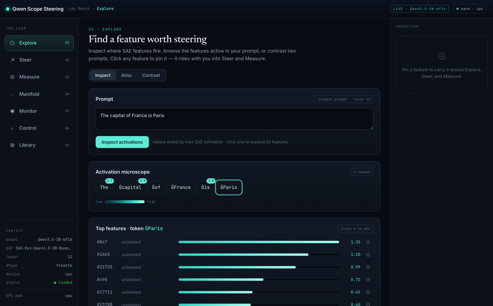
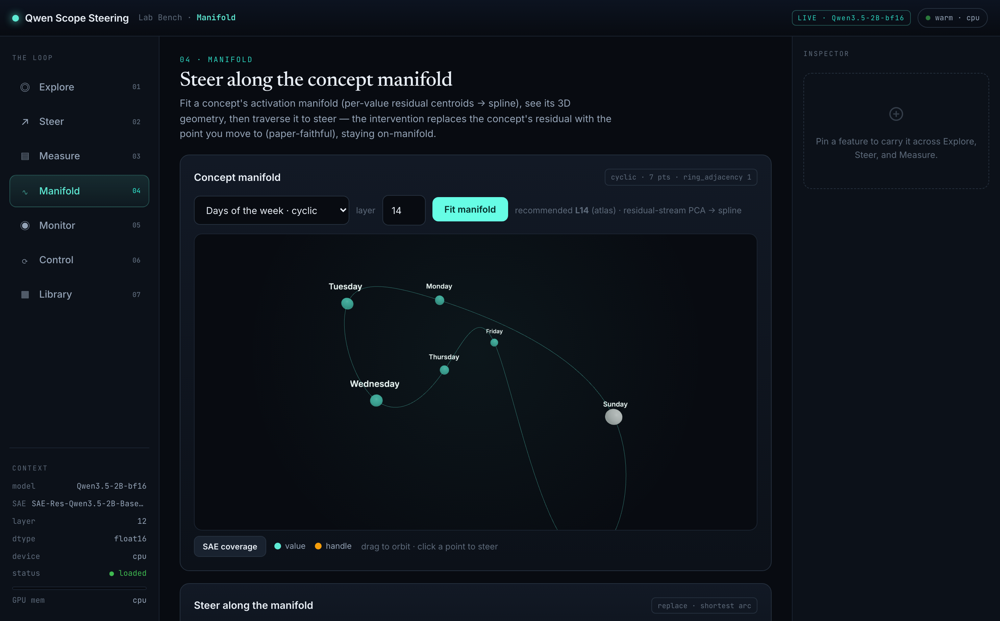

# Qwen Scope Lab on MLX

**A local, browser-based SAE interpretability lab. Inspect, steer, monitor, and control a real language model from a visual GUI — running entirely on your Mac via MLX. No GPU, no cloud, no notebooks.**

[](https://github.com/scasella/qwen-scope-lab/actions/workflows/ci.yml)
[](LICENSE)
[](https://www.python.org/downloads/)



The Lab is a Sparse-Autoencoder interpretability workbench over [Qwen Scope](https://huggingface.co/Qwen) that you drive entirely from a **point-and-click web GUI**. It runs the **whole pipeline on-device via [MLX](https://github.com/ml-explore/mlx)** — the real model **and** its SAE — on **any Apple-Silicon Mac (M1–M4)**: inspect features, steer generation, fit concept manifolds in 3D, train behavior detectors, and run an honest detect→suppress→prove control loop, all locally and offline. A GPU-free dev backend lets you explore the whole interface with no downloads; an optional Modal/CUDA path scales to the 27B and shareable hosted demos.

## Why I built this

I wanted to *use* sparse-autoencoder interpretability hands-on — inspect features, steer a model, train and stress-test detectors — on my own Mac, without a GPU, a cloud bill, or a notebook. So the whole lab runs on Apple Silicon via MLX, behind a point-and-click GUI. More of my projects and research are on my [personal site](https://casella.dev).

## Quickstart — the full lab on your Mac

```bash
pip install -e ".[mlx]"
python serve_web.py --mlx          # the real 2B + its SAE, entirely on-device
# → open http://127.0.0.1:7870 in your browser — the whole lab is a visual GUI
```

That one command runs the whole lab on the real `Qwen3.5-2B` and its Qwen-Scope SAE and serves the GUI in your browser — no Modal, CUDA, or API key needed. First launch downloads the model (~4.5 GB, bf16) and SAE (~540 MB), then caches them; every run after is offline. (Pass `--mlx-sae none` to skip the SAE download and use the probe-only paths; pass `--mlx <repo>` to override the model.) To run the **base** model the SAE was actually trained on — the most faithful pairing for SAE-feature and manifold work — use `python serve_web.py --mlx-base` instead; the instruct default is better for the behavioral demos (jailbreak, refusal, the control loop).

**Just want to explore the interface, with no downloads at all?**

```bash
pip install -e ".[dev]"
python serve_web.py --dev          # a tiny in-memory model — real code paths, toy outputs
```

New here? `docs/USER_GUIDE.md` is a click-along tour of every mode using the app's pre-filled inputs.

## What you can do — the loop

The GUI is one click-through loop — each step is a mode in the left-hand nav: **Explore → Steer → Measure → Manifold → Monitor → Control → Distill → Library.**

- 🔎 **Explore** — a token-level SAE feature microscope; atlas a whole prompt corpus by peak or breadth; contrast two prompts. Pin a feature to carry it into Steer and Measure.
- ↗ **Steer** — dial a feature up or down; live before/after generation; a strength sweep; the logit-effect metric.
- ▤ **Measure** — a **seven-control benchmark** that returns an honest `validated` / `benchmarked` verdict (it only validates if the steer beats prompt-only *and* every control).
- ∿ **Manifold** — fit a concept's residual-stream manifold, render its 3D geometry, steer *along* it with a paper-faithful replace intervention, and run a gradient **pullback** that optimizes the activation inducing a target behavior.
- ◉ **Monitor** — discover the SAE feature(s) or a linear probe that best detect a behavior (refusal, PII, sycophancy…); held-out eval gated by a **random-feature control**; save validated detectors as runtime guardrails.
- ⟳ **Control** — the honest detect→suppress→prove loop: a probe-vs-SAE-vs-judge shootout, robustness under paraphrase, collateral-damage measurement (the "Rogue Scalpel" safety check), CAA-vs-SAE steering, and the **jailbreak-detection suite**.
- ⚗ **Distill** — compile candidate rows into a train-ready SFT corpus with a documented, seeded **mixture** (the mixture-dial compiler) — author the dial visually, see requested-vs-achievable live, and download `sft.jsonl` + a manifest. Compiles data only; it does not train or evaluate.
- ▦ **Library** — save and reuse steering & manifold **recipe cards**.



## Why it's credible — honest controls

A steer "validates" only if it beats a prompt-only baseline **and** seven controls — including a **random-feature control** (inject a *different* feature at the same strength) and a negative-strength control. Detectors are scored against a raw-residual linear probe and a random-feature control, at a **TPR-at-fixed-FPR** operating point — the way a deployed monitor is actually tuned. Suppression only counts if the behavior was present, the steer removed it, **and** nothing else broke; perfect suppression that lobotomizes the model or erodes its refusals is honestly marked `benchmarked`. Negatives are reported, not hidden. (Driving the lab from an agent? Every op runs through a job API and an experiment log — see [`docs/AGENT_RESEARCH.md`](docs/AGENT_RESEARCH.md).)

## Highlight: a free jailbreak detector

A difference-of-means **residual probe** — one dot product on activations the model already computes — detects jailbreak / prompt-injection prompts as well as a paid AI judge, beats the SAE feature, and generalizes to attack families it never saw. It survives **real in-the-wild jailbreaks** too (AUC 0.93 on 300 scraped DAN-style prompts; 0.91 on entirely held-out sources) — with two honest bounds: the detection *threshold* must be recalibrated per traffic distribution, and it detects jailbreak *framing*, not bare harmful *intent* — see [`docs/experiments/JAILBREAK_IN_THE_WILD.md`](docs/experiments/JAILBREAK_IN_THE_WILD.md). Try the live single-message demo at **`/demo`**. Write-ups: [the residual probe (for researchers)](docs/writeups/jailbreak-detection-residual-probe.html) · [for a general audience](docs/writeups/jailbreak-detection-mainstream.html) · [white-box control on Qwen-2B](docs/writeups/white-box-control-qwen-2b.html).

## Highlight: distill a behavior into the weights

The research lane goes one step past runtime steering: **compile a behavior into training data and fine-tune it in** — no hooks at inference. Flagship result: a 4B learns *polite truth-holding under social pressure* from a class-balanced 9B-teacher corpus **without breaking calibration** — train on truth-holding demos alone and calibrated uncertainty collapses (0.275 acceptable); rebalance the same-size corpus with calibration classes and it's fixed in the data (0.625), with truth-holding preserved. Replicated 6/6 seeds, corroborated by an independent rubric judge. The finding, bluntly: **the mixture is the mechanism** — *what* you train on, not how much. Write-up: [Distilling polite truth-holding](docs/writeups/polite-truth-holding-distillation.html) · pipeline: [`docs/experiments/STEERING_TO_DATA_DISTILLATION.md`](docs/experiments/STEERING_TO_DATA_DISTILLATION.md) · corpus compiler (with its honest validation status): [`docs/MIXTURE_DIAL_DISTILL.md`](docs/MIXTURE_DIAL_DISTILL.md).

## Scale up (optional)

The 2B is local-first on MLX. For the **27B** (won't fit a laptop) or a **shareable hosted demo**, use the Modal path:

```bash
pip install -e ".[cuda,modal]"
modal serve modal_app.py            # then open the printed web_gui URL
```

See [`docs/MLX.md`](docs/MLX.md) for the local↔cloud split and fidelity notes, and [`RUNBOOK.md`](RUNBOOK.md) for the Modal commands, GPU targets, and cost discipline. (You can also load the real model on a local CUDA GPU with `".[cuda]"` and `python serve_web.py --config configs/qwen35_2b_dev_l0_100.yaml`.)

## Install options

| Use case | Command |
| --- | --- |
| **Mac, on-device (recommended)** | `pip install -e ".[mlx]"` |
| Explore the UI, no downloads | `pip install -e ".[dev]"` |
| Real model on a CUDA GPU | `pip install -e ".[cuda]"` |
| Drive Modal probes / hosted serve | `pip install -e ".[cuda,modal]"` |
| Everything | `pip install -e ".[all]"` |

The base install is deliberately slim (torch + the web layer); the heavy and cloud dependencies are opt-in extras.

## Documentation

- [`docs/USER_GUIDE.md`](docs/USER_GUIDE.md) — a click-along tour of every mode.
- [`docs/MLX.md`](docs/MLX.md) — running the whole lab on Apple Silicon: architecture, fidelity caveats, what stays on Modal.
- [`docs/MANIFOLD.md`](docs/MANIFOLD.md) — the concept-manifold science, including the honest negatives behind the design.
- [`docs/AGENT_RESEARCH.md`](docs/AGENT_RESEARCH.md) — driving the lab programmatically: the job API, the experiment log, and the honesty contract.
- [`docs/experiments/STEERING_TO_DATA_DISTILLATION.md`](docs/experiments/STEERING_TO_DATA_DISTILLATION.md) — compile a validated steer into SFT/preference data (the bridge from interpretability to a deployable fine-tune).
- [Distilling polite truth-holding (write-up)](docs/writeups/polite-truth-holding-distillation.html) — the v0.6→v1.0 paper: a class-balanced 9B-teacher corpus gives a 4B both truth-holding under pressure and calibrated uncertainty; replicated 6/6 seeds, the fix is the mixture not the count, gpt-5.5-corroborated.
- [`docs/MIXTURE_DIAL_DISTILL.md`](docs/MIXTURE_DIAL_DISTILL.md) — the deterministic mixture-authoring corpus compiler, including the falsification pilot's honest verdict on what the dial does and doesn't buy.
- [`docs/experiments/BEHAVIOR_READOUT_C05.md`](docs/experiments/BEHAVIOR_READOUT_C05.md) — C05: the manifold-vs-linear faithfulness verdict flips on multi-token concepts under a full-string read-out (and on none of the single-token controls).
- [`docs/experiments/MANIFOLD_TO_DATA_PROVENANCE.md`](docs/experiments/MANIFOLD_TO_DATA_PROVENANCE.md) — C09: why *text* distillation cannot carry manifold provenance (a structural negative, confirmed at two model sizes) — and the preregistered distribution-distillation salvage, since executed and **also refuted** (the shuffled-label control beats the geometry-gated arm; the line is closed in both vehicles).
- [`RUNBOOK.md`](RUNBOOK.md) — operational reference: the CLI scripts, recipe commands, and Modal/GPU runbook.

## Acknowledgements

The **Manifold** mode builds on [Goodfire](https://goodfire.ai)'s research on concept-manifold geometry and manifold steering — *"Do Sparse Autoencoders Capture Concept Manifolds?"* (arXiv 2604.28119) and *"Manifold Steering Reveals the Shared Geometry of Representation and Behavior"* (arXiv 2605.05115). This lab replicates and stress-tests their results on Qwen; see [`docs/MANIFOLD.md`](docs/MANIFOLD.md). Built over the [Qwen Scope](https://huggingface.co/Qwen) SAE release.

## Contributing & License

Contributions welcome — see [`CONTRIBUTING.md`](CONTRIBUTING.md). The house rules: keep new capabilities testable GPU-free on the dev backend, build in an honest control from the start, and add tests. Licensed under the Apache License 2.0 — see [`LICENSE`](LICENSE).

<sub>A legacy tabbed Gradio app (`app.py`, installed with `pip install -e ".[gradio]"`) predates the Lab web UI and remains available as an alternative front end.</sub>
